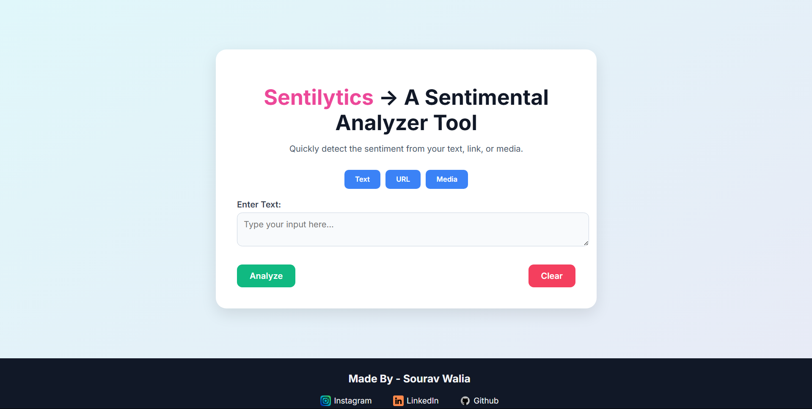
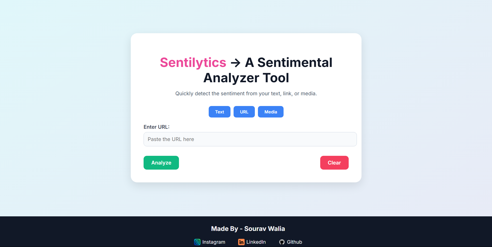
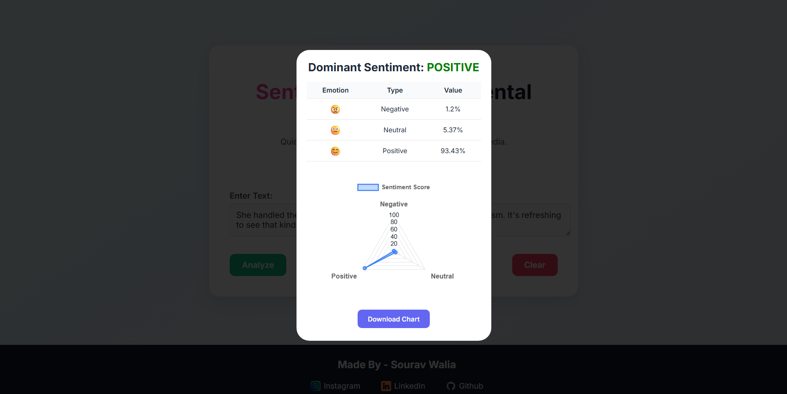
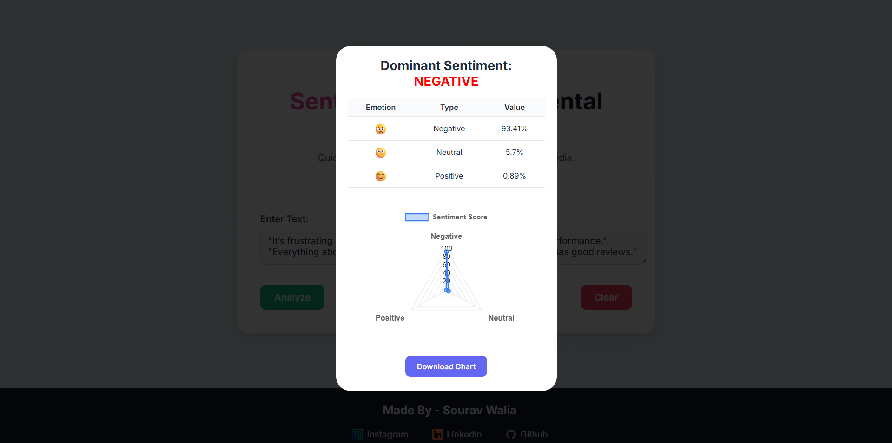
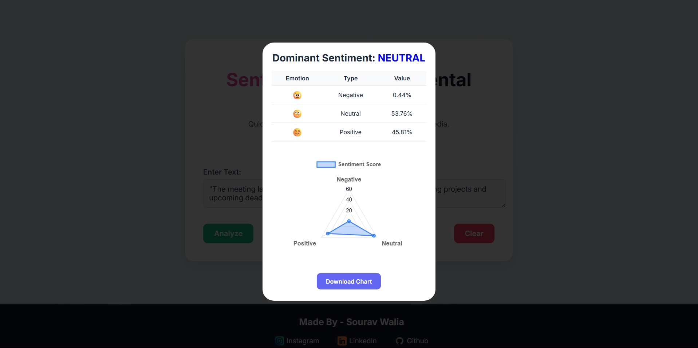
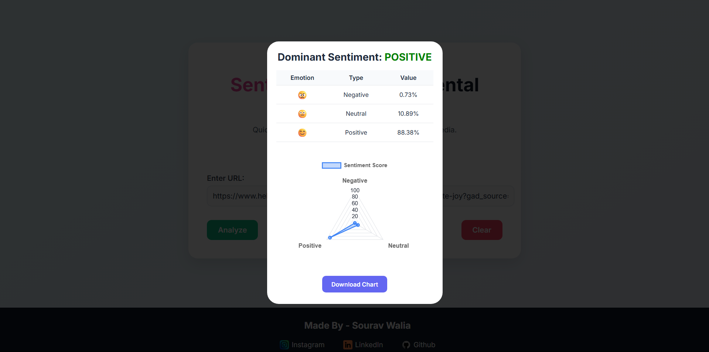
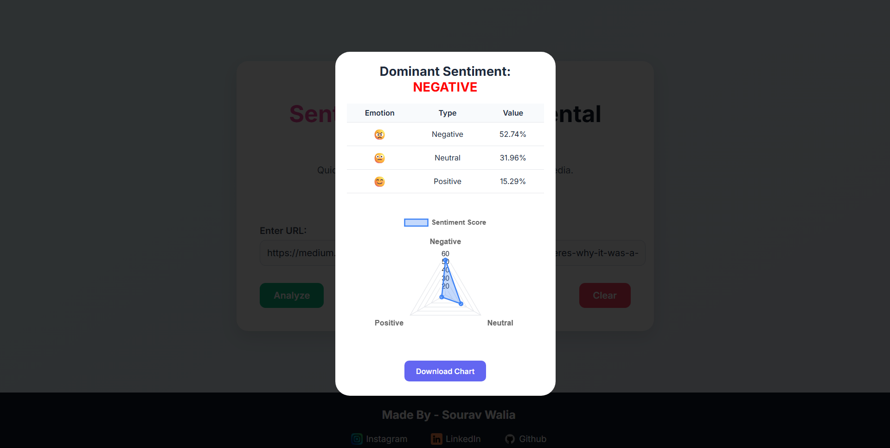

# Sentilytics---A-sentiment-analysis-Tool-using-Python-and-Flask
A web-based sentiment analysis application that leverages **NLP** and **transformer models** (like RoBERTa) to classify sentiment as  'positive', 'negative', or 'neutral' from three types of inputs:
- 🔤 Raw text  
- 🌐 Social media or article URLs  
- 🖼️ Media files (images with captions) (Under Process not working til now)

- Built using **Flask**, **Hugging Face Transformers**, and **PyTorch**, this tool provides an accessible interface for real-time public opinion analysis.

- ---

## ✨ Features

- Accepts input from:
  - Text
  - URLs (with content extraction)
  - Media (images + captions)
- High-accuracy sentiment classification using RoBERTa
- Clean, responsive UI
- Real-time visualization using Chart.js
- Built-in caching and model optimization

- ## 🛠️ Main Tech Stack Used 

- **Python**
- **Flask + Flask-CORS**
- **PyTorch**
- **Hugging Face Transformers**
- **Goose3** (for extracting content from URLs)
- **Chart.js**, **HTML**, **CSS**, **JavaScript**, **Bootstrap**
- **Many more Libraries (in requirements file)**

## 📦 For Installation & Setup
> ✅ Recommended: Use a virtual environment [make a folder in which all the things will stack up in that folder makes your work easy]

- **1.** Clone the repo in to your system.

- **2.** Create and activate virtual environment [use CMD]
-     python -m venv sentiment-env
   
   **To Activate it:**
   
-   for Windows : **sentiment-env\Scripts\activate**
-   for macOS/Linux : **source sentiment-env/bin/activate**

**3.** Install Dependencies 
-     pip install -r requirements.txt

**4.** Set environment variables
-   Create a .env file or rename nano.env as .env 
-   You must create two folders to store model cache locally :--- huggingface_cache and torch_cache.
-   Then, in your .env file, set the path of the following folders.
   
   **These directories will be used to store pre-trained models and other cached files from Hugging Face and PyTorch**

**5.** Run the application
-     python app.py 
-   **Be Sure that before running the Project, Env must be activated --- step-1 can be seen how to activate it**
-   **After activating it run the app and make sure before running you should be in the project directory**

**6.** Open the app
-     Go to http://127.0.0.1:5000 in your browser

  ## 💻 Interface Showcase

Homepage - Text

Homepage - URL
                    

Positive Sentiment - Text

Negative Sentiment - Text

Neutral Sentiment - Text

Positive Sentiment - URL

Positive Sentiment - URL

## 📬 Feedback & Contributions

Feel free to fork the project, open issues, or submit pull requests.  
Your ideas, suggestions, and contributions are always welcome!
